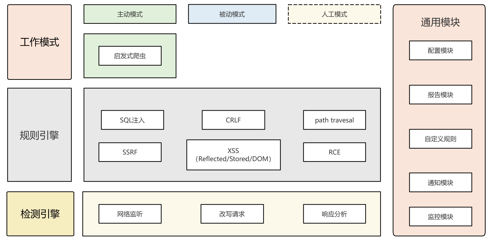

## B1ackH0rse是什么

B1ackH0rse是一个精简的、可高度定制化的黑盒漏洞扫描器，因为最近的项目使用了大名鼎鼎的Xray，但Xray又是半开源的。有很多特殊需求无法满足，而我正在学习rust编程，就想针对这部分需求，开发出一个好用的轻量化web扫描器出来。

到2025年，同类黑盒产品的瓶颈表现于:

- 黑盒自动化测试似乎碰到了瓶颈，常规漏洞的检测几乎很完备了。但对于越权漏洞等如果要高准确率必须结合更多的业务信息来判断；

- Web2.0时代，越来越多的网页使用动态页面，单个URL获取到的HTML很多时候不含有用的信息和接口。必须使用更先进的爬虫技术来获取这些信息。

针对问题一，可尝试通过案例教会大模型如何分辨越权漏洞的存在与否；针对问二，业界通常的思路是启发式爬虫，即模拟人类使用浏览器的行为逐个触发接口和页面。

## 项目框架

整体上说分三层和一列：

* 在顶层用户操作的工作模式层，将支持主动扫描、被动扫描，但不支持人工渗透测试；
* 中间层会提供通用漏洞的测试payload，以及开放给用户自定义的规则配置文件，与其他同类软件不同的是，除了支持自定义规则外，我们还支持对默认测试用例的重写；
* 底层是检测引擎，主要是网络监听、参数分析，读取&响应的修改和判断（也就是漏洞的识别过程）。
* 在此之外，还有些外围的基础模块，如配置模块读取文件，报告模块输出html格式的报告总结，通知模块用于和其他系统联动，自定义规则模块给用户写自制规则，监控模块展示系统的运行状态。

### 设计思路

写一个大而全的自动化扫描器有诸多弊端（要保证任务里的各种报错被妥善处理，用户难以窥探其进展也无法想让它停在某个中间步骤），所以各模块间的解耦和单独使用就显得很重要，这大大提高了整个软件的灵活性。比如可单独使用以下功能： 

>1 --> 高级爬虫，用来提取有用信息：公开信息、Url、接口等。
>
>2 --> 输入接口及参数信息，针对某一类漏洞单独测试。
>
>3 --> 整体的自动化扫描，类似Zap里的自发扫描功能。

### 主动扫描

主动模式下它具备以下特性：

1. 基于hyper实现，可以设置爬虫的协程数，爬取+解析大型网站在数秒之内；
2. 广度+深度优先策略：首先广度获取最多的子域名，然后依次分析每个子域名下的目录；
3. 跟进前、后端URL跳转，使爬虫继续下去（需判断是否在测试范围内）；
5. URL去重、去似、去含，从而提取出值得注入分析的endpoint；
6. 检测表单并自动填写，检测Ajax事件；
7. 断连重试机制；
8. Payload的生成、注入、输出分析功能（Fuzzer）；
9. 简单的报告输出功能（控制台输出）。

### 被动扫描

被动模式下它具备以下特性：

1. 按配置指定的端口进行监听；
2. 对转发的流量自行做参数替换及安全测试；
3. 实现对请求参数的树状展开和fuzz替换功能；
4. Webhook通知功能，这个很重要，用于和其他自动化程序联动。

## POC列表（待修改）

| 模块名称 | 子类明细 | 功能描述 |
| --- | --- | --- |
| 引擎 | | 任务划分、调度、结果汇总 |
| 基础库 | HTTP元素封装、日志库、页面相似度分析等 | 所有功能模块会用的的底层库，如请求收发、日志记录等 |
| 功能模块 | 信息搜集类模块、代码验证类模块 | 一些用于实现具体功能的代码块 |
| URL搜集模块 | | 爬虫获取HTML中所有链接，会涉及到js中链接和事件的触发 | 
| 指纹搜集模块 | | 自己建立知识库太麻烦，最好使用厂家的API |
| POC模块| 通用漏洞模块、Nday漏洞模块| 通用漏洞模块的payload可以从github来，Nday漏洞的检测和pocsuite联动 |
| 报表模块 | | 汇总扫描、分析结果，并归纳形成文档HTML等 | 

## 排期计划

因为是业余时间写的用来rust实战，以周为单位跟进。

| 排期 | 工作项目 | 具体进展 |
| --- | --- | --- |
| 2025.11.17 - 11.24 | 大模块搭建，监听功能实现 | 未开始 |
| 2025.11.24 - 11.31 | http解析、https解析、websocket解析 |未开始 |
| 2025.12.1 - 12.7 |  参数树核心模块！！！| 未开始 |

## 阅读文档

1. [https://github.com/imiyoo2010/teye_scanner_for_book](https://github.com/imiyoo2010/teye_scanner_for_book)
2. [https://www.anquanke.com/post/id/178339]()
2. [http://blog.fatezero.org/2018/03/05/web-scanner-crawler-01/]()
