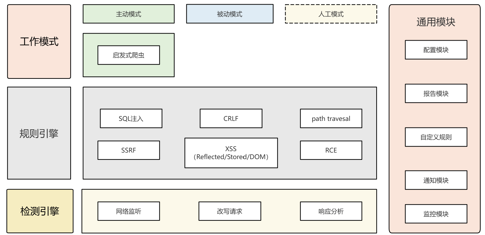

## WHorse是什么

WHorse是一个精简的、可高度定制化的黑盒漏洞扫描器，笔者因为最近参与的项目使用了Xray和Scalpel，对二者优秀的设计印象深刻，但二者又都是半开源的。很多需求无法定制，而笔者又恰好正在学习rust编程，就想针对这部分需求，开发出一个好用的轻量化web扫描器出来。

## 使用方法

因为现在命令行功能还没写完，主要有以下两个用法：

1. 代理启动，`cargo run --release`。
2. 证书生成，在lib.rs中运行第二个测试方法。

但需注意，因为原始代码在linux下开发，在windows中运行时需要安装一些以来才行：

1. nasm工具
2. cmake工具（可以通过visual studio installer安装）
3. 配置环境变量`AWS_LC_SYS_PREBUILT_NASM`的值是`1`，没有则新加。

上述工具安装好后可以在命令行中使用`where`找到所在目录，并添加到PATH中。

## 项目框架

整体上说分三层和一列：

* 在顶层用户操作的工作模式层，将支持主动扫描、被动扫描，但不支持人工渗透测试；
* 中间层会提供通用漏洞的测试payload，以及开放给用户自定义的规则配置文件，与其他同类软件不同的是，除了支持自定义规则外，我们还支持对默认测试用例的重写；
* 底层是检测引擎，主要是网络监听、参数分析，读取&响应的修改和判断（也就是漏洞的识别过程）。
* 在此之外，还有些外围的基础模块，如配置模块读取文件，报告模块输出html格式的报告总结，通知模块用于和其他系统联动，自定义规则模块给用户写自制规则，监控模块展示系统的运行状态。

### 设计思路

写一个大而全的自动化扫描器有诸多弊端（要保证任务里的各种报错被妥善处理，用户难以窥探其进展也无法想让它停在某个中间步骤），所以各模块间的解耦和单独使用就显得很重要，这大大提高了整个软件的灵活性。比如可单独使用以下功能： 

>1 --> 高级爬虫，用来提取有用信息：公开信息、Url、接口等。
>
>2 --> 输入接口及参数信息，针对某一类漏洞单独测试。
>
>3 --> 整体的自动化扫描，类似Zap里的自发扫描功能。

### 主动扫描

主动模式下它具备以下特性：

1. 基于hyper实现，可以设置爬虫的协程数，爬取+解析大型网站在数秒之内；
2. 广度+深度优先策略：首先广度获取最多的子域名，然后依次分析每个子域名下的目录；
3. 跟进前、后端URL跳转，使爬虫继续下去（需判断是否在测试范围内）；
5. URL去重、去似、去含，从而提取出值得注入分析的endpoint；
6. 检测表单并自动填写，检测Ajax事件；
7. 断连重试机制；
8. Payload的生成、注入、输出分析功能（Fuzzer）；
9. 简单的报告输出功能（控制台输出）。

### 被动扫描

被动模式下它具备以下特性：

1. 按配置指定的端口进行监听；
2. 对转发的流量自行做参数替换及安全测试；
3. 实现对请求参数的树状展开和fuzz替换功能；
4. Webhook通知功能，这个很重要，用于和其他自动化程序联动。

## 排期计划

因为是业余时间写的，用来rust实战，以周为单位跟进。

| 排期 | 工作项目 | 具体进展 |
| --- | --- | --- |
| 2025.11.17 - 11.24 | 大模块搭建，监听功能实现 | ✅ |
| 2025.11.24 - 11.31 | http解析、https解析、websocket解析 | 2/3✅ |
| 2025.12.15 - 12.31 | 证书生成、加载逻辑、动态签发证书 | ✅ | 
| 2026.2.1 - 2.28 |  参数树核心模块！！！| 未开始 |

## POC列表（待修改）

| 漏洞名称 | 说明 | 检测方式 |
| --- | --- | --- |
| 敏感字段检查 | 可根据自定义规则和系统规则对请求、响应里包含的敏感字段的位置做标记 | 被动探测 |
| SSRF | 对页面或接口中存在uri等资源加载的地方做服务端请求探测 | 主动扫描+反连验证 |
| ... | ... | ... |

## 阅读文档

1. [https://github.com/imiyoo2010/teye_scanner_for_book](https://github.com/imiyoo2010/teye_scanner_for_book)
2. [https://www.anquanke.com/post/id/178339]()
3. [http://blog.fatezero.org/2018/03/05/web-scanner-crawler-01/]()
4. [https://blog.csdn.net/yuan__once/article/details/137635953](https://blog.csdn.net/yuan__once/article/details/137635953)

## 其他

hyper1.0和之前有了很大的改版，这些变动记录如下：
a. 创建服务直接从socket层开始，并service_fn限定了待转换函数只有一个入参。
b. 服务函数入参变为Incoming，出参为Full包裹的hyper::body::Bytes。
